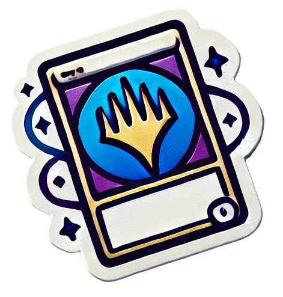
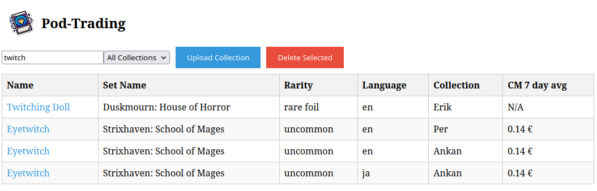

## Pod-Trading - MTG Collection Sharing Application

Pod-Trading is a simple web application designed to facilitate the trading of Magic: The Gathering (MTG) cards among a group (pod) of players. It allows players to upload their collection in CSV format, search for cards, applications such as ManaBox allows user to scan and create collections but there is no easy way to browse pod members collections.

The application is developed to work primarily with the files exported by https://manabox.app/ , others might work but are not officially supported.

### Features

- Upload Collections: Players can upload their card collection in CSV format, making it easy to manage and trade cards.
- Search Functionality: Search for cards by name, the results shows set, foil status, rarity, price, and language within uploaded collections. Searching by set or other feature can easily be implemented.
- Collection Management: Filter collections by collection name to view the contents of each player’s collection.
- Multisearch, users are able to post a decklist from Moxfield, MTGA or MTGO and get all matches for those cards in either one or more collections.
- Card Link Integration: Each card name is clickable and links to its Scryfall page for detailed information.
- Password-Protected Actions: Secure uploads and deletions of collections with a common password.
- Delete Collections: Players can delete uploaded collections with proper authentication.
- Responsive Design: User-friendly interface for managing collections and trades.
- Downloads daily bulk information from Scryfall to show 7 day average euro price from cardmarket

### Tech Stack

Frontend:
- Vue.js: A progressive JavaScript framework for building user interfaces.
- HTML5 & CSS3: For structure and styling.
- JavaScript: For dynamic functionality.

Backend:
- Node.js: A JavaScript runtime built on Chrome's V8 engine.
- Express.js: A minimal and flexible Node.js web application framework.
- Multer: Middleware for handling multipart/form-data for file uploads.
csv-parser: For reading and parsing CSV files.
- Database: File-based storage using CSV files.
- Environment Management: dotenv for loading environment variables.

### Prerequisites

- Node.js (v18 or later)
- NPM (Node Package Manager)
- Docker (for deployment)

### Getting Started

Clone the repository:

    git clone https://github.com/harring/pod-trading.git
    cd pod-trading

Edit the example .env file in server to set the password, if you set no password it will default to "harring".

To deploy the application using Docker:

    docker build -t pod-trading .
    docker run -p 3000:3000 pod-trading
Mounting scryfall and textfile directories will allow for persistent storage.

The application will be accessible at http://localhost:3000.

### Security

The application uses a password stored in an .env file for authenticating sensitive actions such as file uploads and deletions.
Ensure the .env file is secure and never pushed to version control.

### Contributions

Contributions are welcome! Please fork the repository, create a feature branch, and submit a pull request.
License

This project is licensed under the MIT License.

Enjoy trading with your friends in your own private MTG trading pod!

### Changes
2024-10-30
- Move search logic to backend for experience to be better
- Loading page now shows 10 most expensive cards in each collection
- Multisearch added, you can now paste a decklist and get all exact matches from either one or all collections
- Known issue: Initially loaded list of cards is sorted by owner and not value