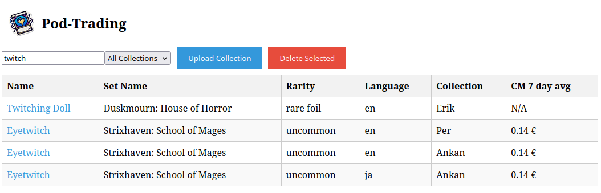

## Pod-Trading - MTG Collection Sharing Application

Pod-Trading is a simple web application designed to facilitate the trading of Magic: The Gathering (MTG) cards among a group (pod) of players. It allows players to upload their collection in CSV format, search for cards, applications such as ManaBox allows user to scan and create collections but there is no easy way to browse pod members collections.

The application is developed to work primarily with the files exported by https://manabox.app/ , others might work but are not officially supported.

### Features

- Upload Collections: Players can upload their card collection in CSV format, making it easy to manage and trade cards.
- Search Functionality: Search for cards by name, the results shows set, foil status, rarity, price, and language within uploaded collections. Searching by set or other feature can easily be implemented.
- Collection Management: Choose a collection to browse all its cards or rerun the active name/decklist search. The selector keeps all collections available even when a search has no matches. All Collections shows the top ten cards per collection when no search is active.
- Multisearch, users are able to post a decklist from Moxfield, MTGA or MTGO and get all matches for those cards in either one or more collections.
- Card Link Integration: Each card name is clickable and links to its Scryfall page for detailed information.
- Password-Protected Actions: Secure uploads and deletions of collections with a common password.
- Delete Collections: Players can delete uploaded collections with proper authentication.
- Responsive Design: User-friendly interface for managing collections and trades.
- Downloads daily bulk information from Scryfall to show EUR market prices.

### Tech Stack

Frontend:
- Vue.js: A progressive JavaScript framework for building user interfaces.
- HTML5 & CSS3: For structure and styling.
- JavaScript: For dynamic functionality.

Backend:
- Node.js: A JavaScript runtime built on Chrome's V8 engine.
- Express.js: A minimal and flexible Node.js web application framework.
- Multer: Middleware for handling multipart/form-data for file uploads.
csv-parser: For reading and parsing CSV files.
- Database: File-based storage using CSV files.
- Environment Management: dotenv for loading environment variables.

### Prerequisites

- Node.js (v18 or later)
- NPM (Node Package Manager)
- Docker (for deployment)

### Getting Started

Clone the repository:

    git clone https://github.com/harring/pod-trading.git
    cd pod-trading

Copy `server/.example-env` to `server/.env` and set `SECRET` to your chosen password. The server refuses to start if `SECRET` is missing or blank.

To deploy the application using Docker:

    docker build -t pod-trading .
    docker run --env-file server/.env -p 3000:3000 pod-trading
Mounting scryfall and textfile directories will allow for persistent storage.

The application will be accessible at http://localhost:3000.

### Security

The application uses a password stored in an .env file for authenticating sensitive actions such as file uploads and deletions.
Upload API clients must send the password in the `password` request header so authentication happens before the server writes any uploaded file. A password sent only as a multipart form field is not accepted.
Collection names must contain 1–80 letters, numbers, spaces, underscores or hyphens, begin with a letter or number, and have no trailing spaces. Existing files with other names must be renamed to appear in searches. Symlinks are not accepted as collections.
Uploads accept one `.csv` file up to 10 MiB, with unique, non-empty headers including `Name` and `Scryfall ID`, at least one card, and non-empty values in both required columns. Rows must have consistent column counts and be at most 64 KiB. Failed validation or price processing leaves an existing collection untouched.
Search queries are limited to 200 characters; multisearch accepts 1–500 non-empty terms of up to 200 characters each. Invalid requests return JSON errors (`400`, or `413` for size limits); missing collections return `404`.
Ensure the .env file is secure and never pushed to version control.

### Contributions

Contributions are welcome! Please fork the repository, create a feature branch, and submit a pull request.
License

This project is licensed under the MIT License.

Enjoy trading with your friends in your own private MTG trading pod!

### Changes

2026-09-10

- Authenticate uploads before processing files and require an explicitly configured `SECRET`; upload clients now send passwords in a request header.
- Validate collection names, search inputs and CSV contents; limit uploads to 10 MiB and block path traversal and symlink access.
- Cache Scryfall prices by card ID, validate downloads before replacing cached data, and atomically replace collection CSVs. Serialize collection changes to prevent conflicting writes.
- Preserve `Purchase price` and store current foil/non-foil prices separately in `Market price EUR`.
- Keep all collection options available after searches, refresh results when selections change, and browse every card in a selected collection.
- Show actionable request errors, retain failed forms for retry, prevent duplicate submissions, and distinguish successful actions from failed refreshes.
- Add backend and frontend regression tests and document setup, migration considerations and verification commands.

2024-10-30
- Move search logic to backend for experience to be better
- Loading page now shows 10 most expensive cards in each collection
- Multisearch added, you can now paste a decklist and get all exact matches from either one or all collections
- Known issue: Initially loaded list of cards is sorted by owner and not value

### Price updates

Scryfall prices are indexed once on startup and refreshed daily at 10:00 UTC. Downloads are staged and validated before replacing the cached dataset; failed refreshes keep the last valid prices available. If the startup cache is missing or invalid, the server attempts a download. Uploads wait for an available price snapshot.

Collections store current prices in `Market price EUR`, using `eur_foil` for foil cards and `eur` otherwise. Missing prices display as `N/A`. Search results and top cards sort by market price. The original `Purchase price` column is preserved. Existing collections gain the market-price column on their next successful scheduled update or re-upload; prices previously overwritten by older versions can only be restored from the original export.

CSV replacements use temporary files on the same filesystem and atomic renames. Within one server process, uploads, deletions and price updates are serialized per collection. Run one server instance per shared data directory.

### Verification

Run `npm ci` and `npm test` in `server` for API, upload protection and price-update regression tests. In `client`, run `npm ci`, `npm test`, and `npm run build` for collection navigation, request failure handling and the production build. Client tests exercise component methods with simulated responses; they do not run a browser.

Request errors appear in the page or active form. Failed uploads, deletions and decklist searches retain the form for retry; pending uploads and deletions prevent duplicate submissions. A successful mutation followed by a failed refresh is reported separately, so users do not repeat an action that already succeeded.
